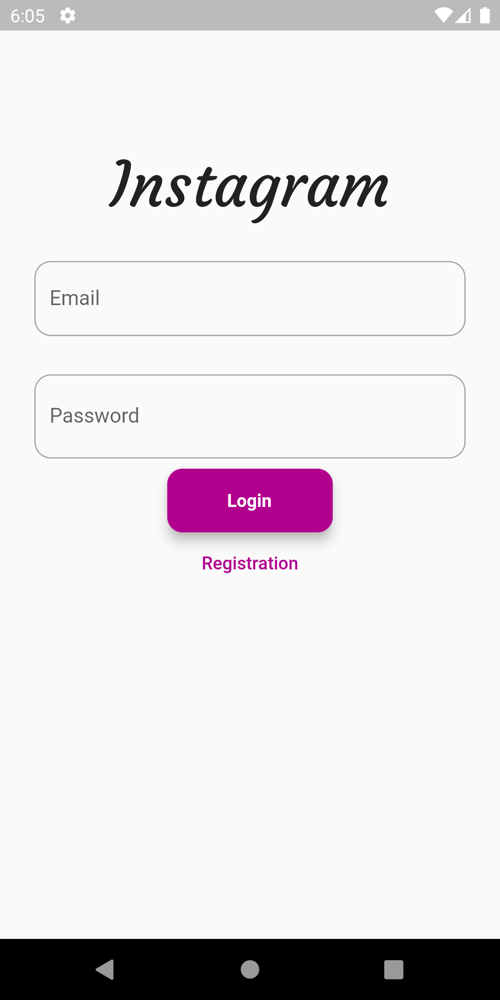
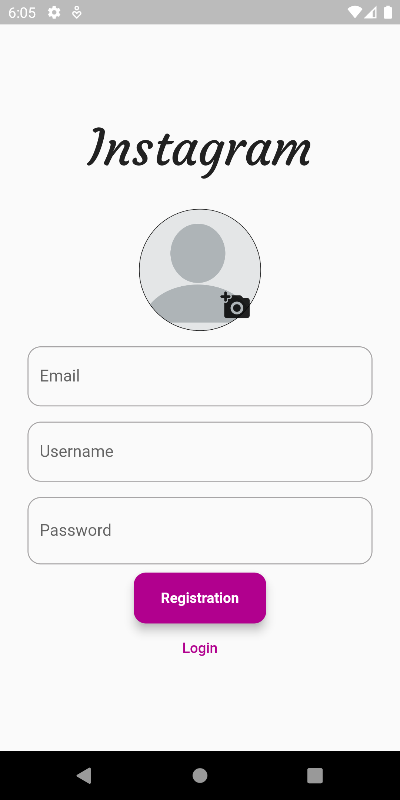
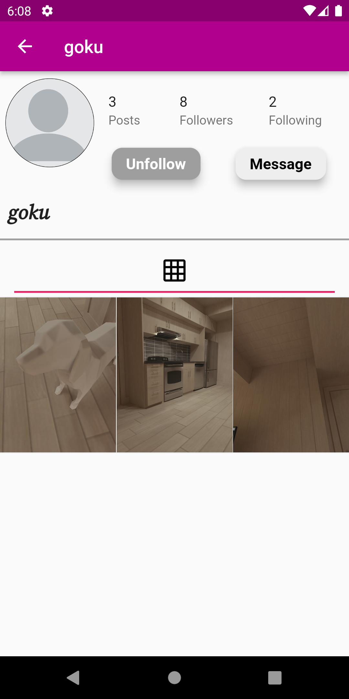

# Instagram Clone App

Welcome to the Instagram Clone App repository! This app is designed to replicate the core features of the popular social media platform Instagram. Users can interact with the app by registering, posting images/videos, liking, commenting, following other users, sending messages, and more. The app utilizes Firebase for backend services and Provider for state management.

## Features

- **Authentication**: Users can register and log in securely using Firebase authentication.
- **Post Media and Captions**: Users can post images or videos along with captions.
- **Interaction**: Users can like, save, and comment on posts.
- **Search Users**: Search for other users based on their usernames.
- **Follow/Unfollow**: Follow and unfollow other users to stay connected.
- **Home Feed**: View posts from users you are following, sorted by date.
- **Stories**: Users can post and view stories from users they follow.
- **Direct Messaging**: Send and receive messages with other users in real time.

## Technologies Used

- Flutter: A UI toolkit for building natively compiled applications for mobile, web, and desktop from a single codebase.
- Firebase: A comprehensive platform that provides various backend services, including authentication, database, storage, and more.
- Provider: A state management solution that helps manage and update app state efficiently.
- Other Flutter packages:
  [ cloud_firestore,
  firebase_auth,
  firebase_messaging,
  firebase_ui_auth,
  firebase_storage,

  provider,
  intl,
  image_picker,
  uuid,
  video_player,
  flutter_instagram_storyboard,
  animated_splash_screen]
  

## Installation

1. Clone this repository: `git clone https://github.com/your-username/instagram-clone.git`
2. Navigate to the project directory: `cd instagram-clone`
3. Install dependencies: `flutter pub get`
4. Set up Firebase (Add New Project To Firebase): [https://console.firebase.google.com/u/0/]
5. Go To "lib/Utils/Constants.dart " Edit it 
6. Run the app: `flutter run`

## App Demo

## Screenshots

  
  
  

## Contact

For any inquiries, please contact [esmahiayoub08@gmail.com].

Happy coding!
